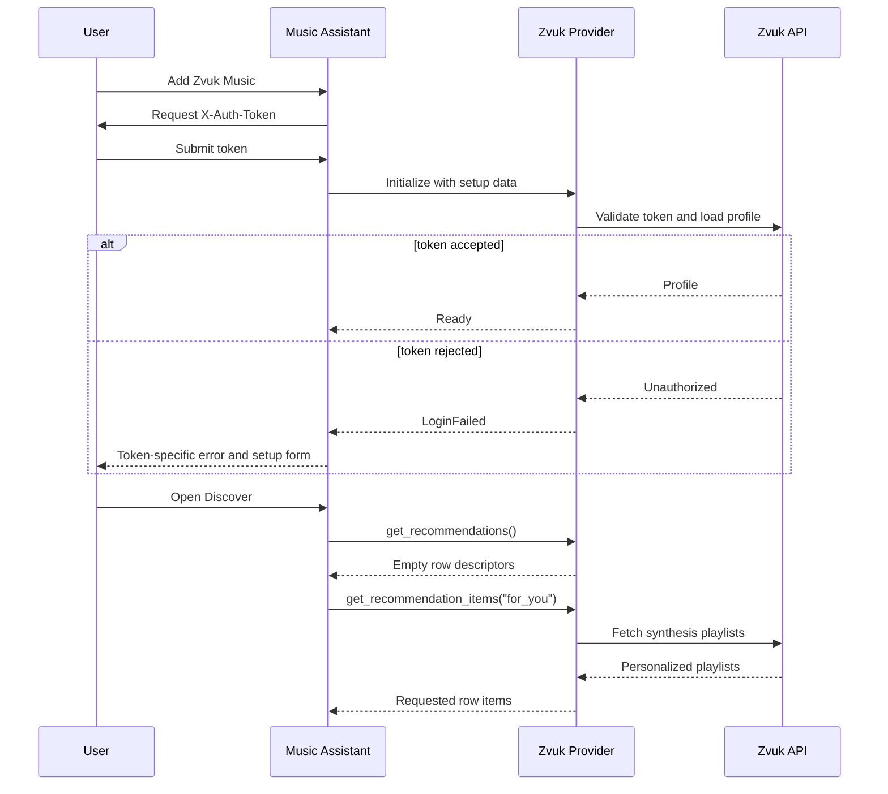

## Problem Statement

New Zvuk Music instances could be created without collecting the required
X-Auth-Token after Music Assistant replaced the legacy options-based setup.
The incomplete instance then failed to load, leaving the user without a form in
which to provide the missing token. Rejected tokens also produced a generic
credentials message that did not identify the token the user needed to replace.

Discover additionally loaded every Zvuk recommendation playlist before knowing
which rows the user had enabled. Hidden recommendation rows therefore generated
unnecessary backend traffic and delayed the initial Discover response.

## Solution Summary

Zvuk Music now collects the X-Auth-Token in a dedicated setup flow and stores it
as setup data, while existing configuration-backed tokens remain readable
through Music Assistant's compatibility fallback. Authentication failures use
a provider-specific token message. Recommendation discovery returns two static
row descriptors without contacting Zvuk; playlists are fetched only when Music
Assistant requests the personalized or editorial row. Existing browse paths
continue to use the same playlist-fetching helpers.

## Acceptance Criteria

1. A new provider installation asks for a required secure X-Auth-Token before
   Music Assistant creates the instance.
2. When validation rejects a token, the setup form reappears with the rejected
   value preserved and a localized sign-in error.
3. Existing instances whose token is stored in provider configuration continue
   to load through the setup-value compatibility fallback.
4. Opening provider options exposes audio quality but does not expose or clear
   the authentication token.
5. Recommendation row discovery returns `for_you` and `editorial` without any
   Zvuk API request.
6. Requesting one recommendation row fetches only that row's playlists, while
   an unknown row returns an empty result without backend traffic.
7. The existing `for_you` and `editorial` browse paths return the same playlists
   as before this change.

## Test Plan

- `tests/test_setup_flow.py` verifies successful submission, validation retry,
  option visibility, setup-backed initialization, authenticated image fetching,
  and provider-specific strings.
- `tests/test_recommendations.py` verifies zero-I/O row discovery, isolated
  per-row fetching, and empty unknown-row behavior.
- `tests/test_provider_browse.py` remains the regression suite for browse paths
  and playlist results.
- The full pytest, Ruff, mypy, and pre-commit gates verify compatibility with the
  complete standalone provider and current Music Assistant development branch.

## Sequence Diagram

